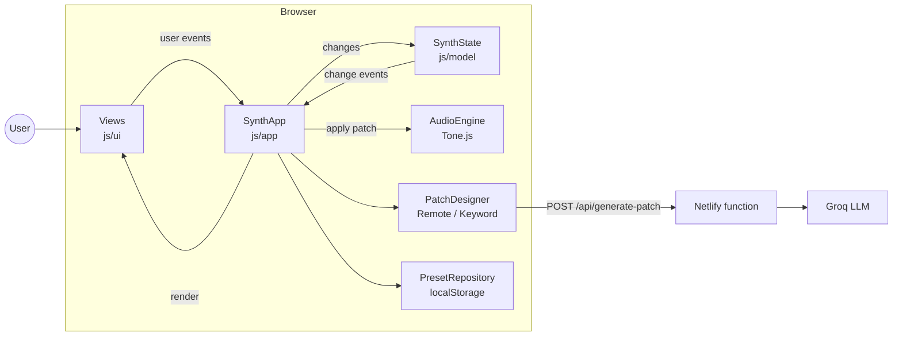

# AeroWave AI

An AI-powered wavetable synth for beginner sound design. Describe a sound in plain language, hear it instantly, and learn the synth parameters that created it.

Live demo: https://wavetablesynth.netlify.app/

Built at BorderHack 2026 (UTEP) — 2nd place out of 32 teams.

## What it does

AeroWave lowers the first barrier to synthesis. Instead of learning what "ADSR" or "filter cutoff" means before you can make a sound, you start with everyday words and build intuition by adjusting the controls and listening.

Prompt -> Patch -> Play:

1. Describe — type something like "warm ambient pad" or "dreamy pluck".
2. Generate — an AI model returns a structured patch (waveform, ADSR, filter, effects) as JSON.
3. Reveal — every value maps to a visible, labeled control, so you see why the sound is what it is.
4. Play and refine — use the on-screen keyboard, tweak the knobs, and hear each change.

The point isn't to hide the work behind the AI — it's to turn its output into learnable decisions.

## Features

- Polyphonic synth engine built on Tone.js
- Oscillators (sine / saw / square / triangle) with detune, ADSR envelope, low-pass filter (cutoff + resonance), and volume
- Effects chain: reverb, delay, chorus, distortion
- Playable on-screen keyboard, hold mode, and saveable presets
- Natural-language prompt -> JSON patch via an AI endpoint, with a built-in fallback sound map if the API is unavailable

## How it works

Prompts go from the browser to a Netlify serverless function, which adds the sound-design instructions, calls the AI provider, and returns a JSON patch; the UI then updates every control to match. The API key and the system prompt stay server-side and are never exposed to the browser.

Flow: Browser UI (HTML/CSS + Tone.js) -> Netlify function -> AI model (Groq) -> sound + visible knobs

## Tech stack

Tone.js (Web Audio) · HTML / CSS / JavaScript (ES modules, no build step) · Groq API (provider-swappable) · Netlify (static site + functions) · Node's built-in test runner

## Architecture

The app is a small object-oriented system with one-way data flow:



- **One-way data flow.** Views only report what the user did. `SynthApp` decides what it means and updates `SynthState`, whose change events re-render the views and update the audio engine. Views never call each other.
- **Polymorphism.** `SynthApp` depends on the abstract `PatchDesigner` interface. The AI-backed `RemotePatchDesigner` and the offline `KeywordPatchDesigner` are interchangeable; the fallback is just a second designer.
- **Encapsulation.** Classes keep their internals in private `#fields`. `Patch` is immutable and validates every value, so out-of-range or malformed AI output can't reach the audio engine.
- **Dependency injection.** `main.js` is the only file that touches browser globals. It passes `Tone`, `localStorage`, and the API endpoint into the classes that need them, which is what lets the tests use fakes.
- **Single source of truth.** `js/model/params.js` defines every parameter's range once; the knobs, the validator, and the AI system prompt all read it.

### Project structure

```
index.html                     markup only
css/                           one stylesheet per area, linked in cascade order
js/
  main.js                      composition root: builds every object and starts the app
  app/SynthApp.js              controller: turns user actions into state changes
  core/EventEmitter.js         observer base class for the state and the views
  model/
    params.js                  every parameter's range, default and precision (shared with the server)
    Patch.js                   immutable, validated synth patch
    SynthState.js              the current sound; emits change events
    Preset.js                  a saved sound
  audio/
    AudioEngine.js             Tone.js signal chain and note playback
    waveshapes.js              wave shapes for the wavetable display
  ai/
    PatchDesigner.js           abstract interface: description -> sound
    RemotePatchDesigner.js     asks the serverless function (AI)
    KeywordPatchDesigner.js    offline keyword recipes (fallback)
  storage/PresetRepository.js  saved presets in localStorage
  ui/
    View.js                    base class for every UI component
    *View.js, SaveDialog.js    one class per panel
server/
  patchPrompt.js               system prompt (built from params.js) and reply parser
  GroqClient.js                Groq chat-completions client
netlify/functions/
  generate-patch.js            HTTP handler: validates the request, calls the model
test/                          unit tests
```

To add a synth parameter: add it to `PARAMS` in `js/model/params.js`, add a `.knob-card[data-param="..."]` to `index.html`, and use it in `AudioEngine`. The knob range, readout, validation, JSON view, and AI prompt pick it up automatically.

## Getting started

Prerequisites: Node.js 20+, a Groq API key, and the Netlify CLI (`npm install -g netlify-cli`).

```
git clone https://github.com/tripscode/WavetableSynth.git
cd WavetableSynth
echo "GROQ_API_KEY=your_key_here" > .env   # do not commit this
netlify dev
```

Without an API key the synth still works: Generate falls back to the built-in keyword patches.

For production, deploy through Netlify and set GROQ_API_KEY in your site's environment variables.

The function uses Groq's `openai/gpt-oss-120b` model by default. Groq retires models from time to time ([deprecations](https://console.groq.com/docs/deprecations)); to switch without a code change, set a `GROQ_MODEL` environment variable in Netlify and redeploy.

## Testing

```
npm test
```

Runs the unit tests with Node's built-in test runner; there is nothing to install. They cover patch validation, app state, presets and storage, both patch designers, the audio engine (against a fake Tone.js), and the serverless function (with the AI provider stubbed). GitHub Actions runs them on every push and pull request.

## Roadmap

Bilingual (EN/ES) UI, guided ADSR/filter mini-lessons, classroom mode with shared presets, WAV export, and MIDI support.

## Acknowledgments

Built for BorderHack 2026, hosted by GDG on Campus UTEP. Thanks to my teammates for the 24-hour build.
